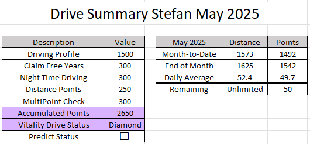
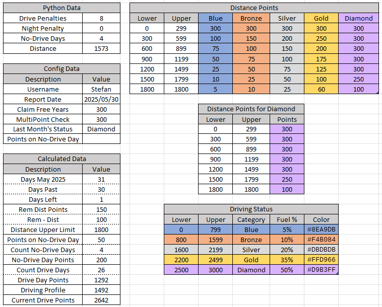

<!-- # Excel Drive Summary -->

## Discovery Vitality Drive Dashboard Excel Summary
**by Stefan Oberholzer, 2024.**

Process Discovery Vitality Drive's DQ Mapper Movement Report to predict the month's drive status in Excel.

 \
*Figure: Drive Dashboard Summary in Excel.*

## Approach
**Python** is used to process DQ Mapper Movement Reports to analyze driving behavior and summarize results in an Excel dashboard. The [main.py](main.py) script calculates the following aspects:

1. The number of no-drive days for the month-to-date.
2. Driving violations, like harsh braking, acceleration and cornering. 
3. Speed violations, optionally using the HERE API to get the true speed limit of the road.
4. Penalties for night-time driving based on trip times.
5. Total distance driven.

**Excel** uses the results of the python output to make the driving status prediction. Many hidden calculated fields are used to make the prediction. The python, configuration and calculated data, with the corresponding lookup tables are shown below.

 \
*Figure: The python, configuration and calculated data, with the corresponding lookup tables.*